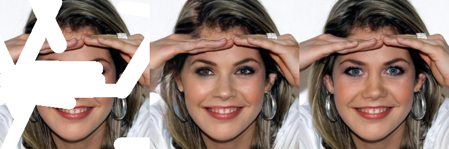

# AGG: Attention-based Gated Convolutional GAN for Image Inpainting with Prior Guided (Neural Computing and Applications)

## Xiankang Yu, Lei Dai, Zhihua Chen, and Bin Sheng

[paper](https://link.springer.com/article/10.1007/s00521-024-09785-w)


## Requirements

- python 3.8
- pytorch >= 1.10
- torchvision
- NVIDIA GPU & CUDA 

Then 
```
$git clone 
$cd ./AGGNet
$pip install -r requirements.txt
```

## Prepare a dataset

1. you can download the [CelebA-HQ](https://www.kaggle.com/datasets/badasstechie/celebahq-resized-256x256) 、 [Places2](http://places2.csail.mit.edu/download.html) or 
[Paris StreetView](https://drive.google.com/open?id=1YXEMiAuaVjMm4jmoZPvMyddAmAyRPVfV) dataset for training
2. or any image dataset
3. use the [Canny edge](https://github.com/DCurro/CannyEdgePytorch) to synthesis the contour prior for train

## Pretrain Weights
you can download the pretrained weights from:  
|Dataset| Params |models|
|:----:|:-----:|:--------:|
|CelebA-HQ(256x256) | 65M| [googleDisk](https://drive.google.com/drive/folders/1WW9Kdx_aYDcLfNcWobpzEqhDuU5Iiveo)|
PSV(512x512)|    65M    |[googleDisk](https://drive.google.com/drive/folders/1cS-N8vqTjVSSDg7XqG9VESdIGaXFHJwC?usp=sharing)|
Places2(512x512)| 101M | [googleDisk](https://drive.google.com/drive/folders/1w6Amhdx0bbXInPP7w5sIJ3YT932bSOFd?usp=sharing)|

#### Note: contour prior of pre-trained model is from the full image, then using a mask to get the masked contour map for training, so if you use the contour map from the masked image, there may be some issues.

## Train
1. config the train setting in **configs/dataset_xxx.yaml**
2. when train the different images size, the param to get mask need some change.
```python
# you can change the param in ./data/util/mask.py  line 232
# and change the random mask ratio in line 319

# the 256 size mask set
def random_irregular_mask(img_shape,
                          num_vertices=(5, 8),
                          max_angle=4,
                          length_range=(80, 200),
                          brush_width=(20, 30), # you mask set this to (30, 40) if you 
                          dtype='uint8'):       # want get mask ratio over 0.4

# the 512 size mask set
def random_irregular_mask(img_shape,
                          num_vertices=(5, 9),
                          max_angle=4,
                          length_range=(150, 400),
                          brush_width=(20, 30), # you mask set this to (30, 40) if you 
                          dtype='uint8'):       # want get mask ratio over 0.4

```
3. Run the script using command 
```python
# train Paris StreetView or CelebA
python train.py --cfg configs/dataset_xxx.yaml

# train places2
python train_places2.py --cfg configs/dataset_xxx.yaml

```

## Test with metrics
1. Run the script using command 
```
python test.py --cfg configs/celebaV3.yaml --out_dir ./test_out/celeba/  \
                --model ./results/celeba/models/generator_xx.pth  \
                --image_size 256
```
2. the FID score is calcute based a pretrained InceptionV3 networks, so it my different when you choose different pretrained weights.

## Predict(Only output images)
```
python predict.py --cfg configs/celebaV3.yaml --out_dir ./test_out/celeba/  \
                  --model ./results/celeba/models/generator_xx.pth  \
                  --image_size 256
```

## Experimental results
### the image order is masked 、result and GT



## Citation
```
@article{yu2024agg,
  title={AGG: attention-based gated convolutional GAN with prior guidance for image inpainting},
  author={Yu, Xiankang and Dai, Lei and Chen, Zhihua and Sheng, Bin},
  journal={Neural Computing and Applications},
  pages={1--16},
  year={2024},
  publisher={Springer}
}

```
if you have any problems, you can report a issue or just send email to <yin950429@hotmail.com>.


