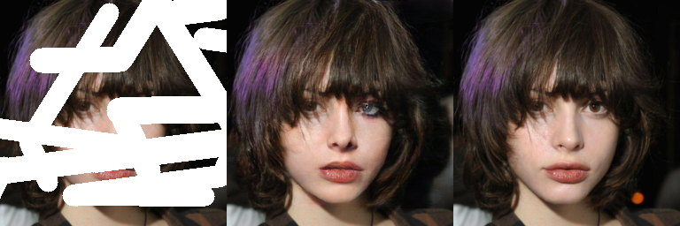

# AGG: Attention-Based Gated Convolutional GAN for Image Inpainting with Prior Guided

AGGNets is a GAN-based network for image inpainting. This work is combine gated convouiton with attention mechanism. we also use the prior infomation for guided.




## Requirements

- python 3.8
- pytorch >= 1.10
- torchvision
- NVIDIA GPU & CUDA 

Then 
```
$git clone 
$cd ./AGGNets
$pip install -r requirements.txt

```

## The paper has been accepted, and we will release the codes and pre-trained weights as soon as possible.

## Problems
if you have any problems, you can report a issue or just send email to <yin950429@hotmail.com>.
